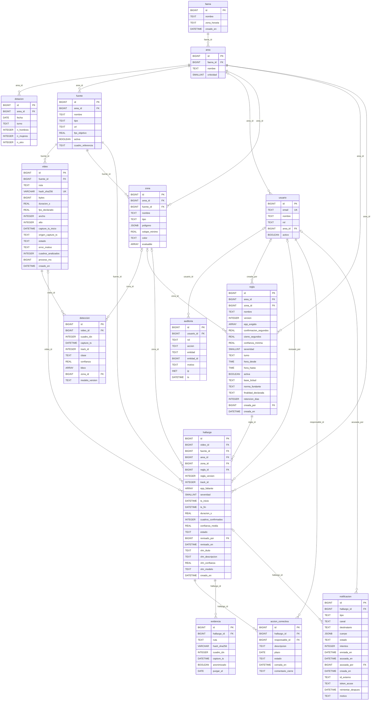

# Diagrama entidad-relación

Generado por `scripts/exportar_esquema.py` desde `gepp_bd.modelos`. La explicación de cada tabla está en [`docs/arquitectura/01-modelo-de-datos.md`](../../../../docs/arquitectura/01-modelo-de-datos.md).

